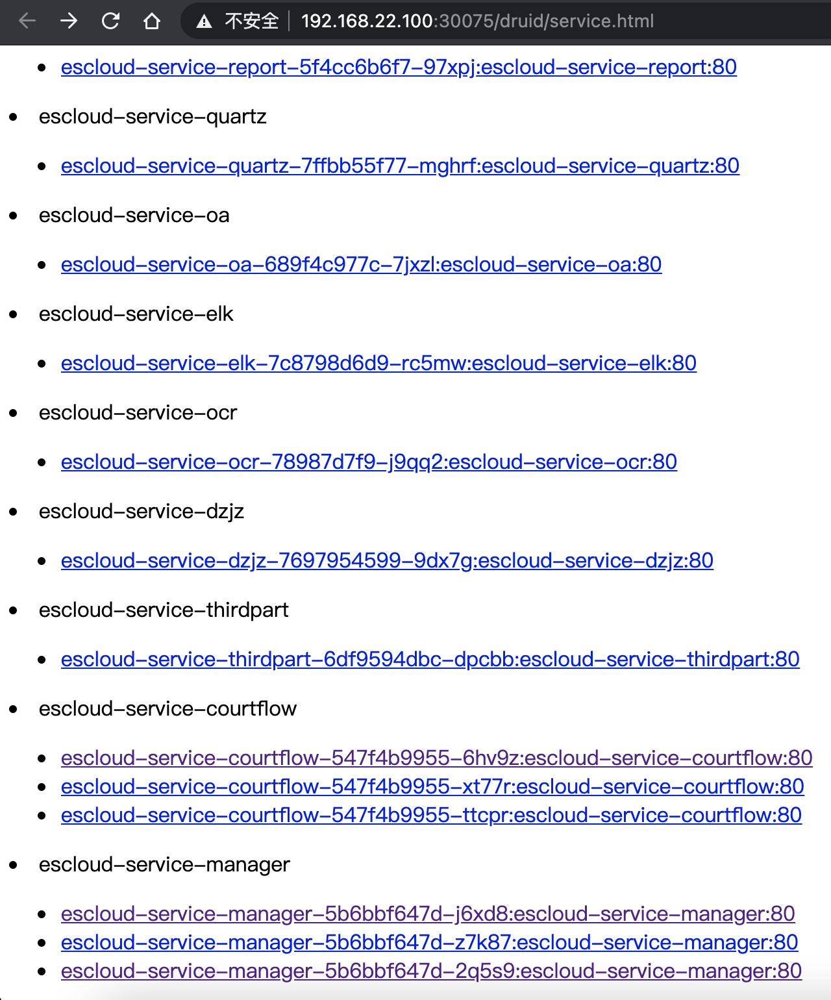
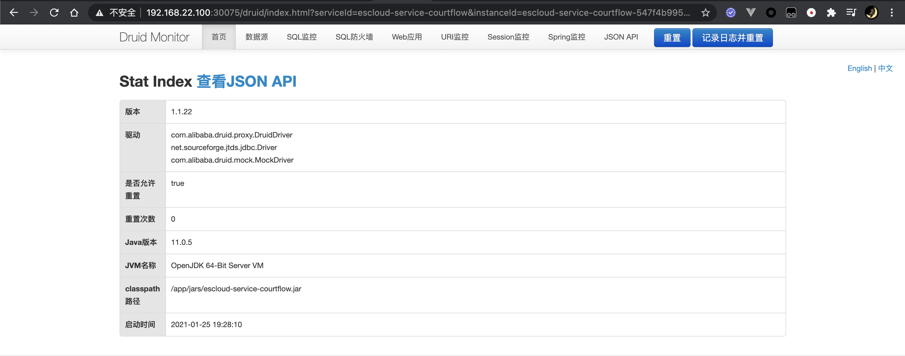
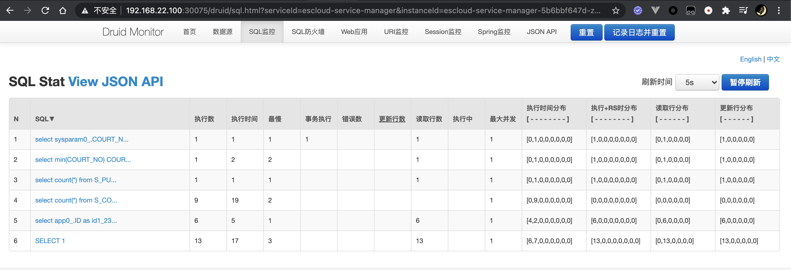

# 目录

- [功能](#功能)
- [效果展示](#效果展示)
- [配置](#配置)
- [项目实例](#项目实例)

# 功能

- 支持集群状态下的集群监控
- 支持 Spring Boot 自动配置
- 支持 eureka, consul, nacos 三种注册中心

# 效果展示

- 微服务实例页面

  
  
  `丑是丑了点，原谅一个 Java 后端没啥审美。`

- 首页
  
  
  
- 数据源
  
  
  
- SQL 监控
  
  

# 配置

1. . pom.xml 中引入依赖

```xml
<dependency>
    <groupId>com.github.benfromchina</groupId>
    <artifactId>druid-admin-spring-boot-starter</artifactId>
    <version>1.0.0</version>
</dependency>
<!-- druid 监控底层基于 servlet ，需要 web 模块支持 -->
<dependency>
    <groupId>org.springframework.boot</groupId>
    <artifactId>spring-boot-starter-web</artifactId>
    <version>${spring-cloud.version}</version>
</dependency>
```

- eureka 注册中心引入

```xml
<dependency>
    <groupId>org.springframework.cloud</groupId>
    <artifactId>spring-cloud-starter-netflix-eureka-client</artifactId>
    <version>${spring-cloud.version}</version>
</dependency>
```

- nacos 注册中心引入

```xml
<dependency>
    <groupId>com.alibaba.cloud</groupId>
    <artifactId>spring-cloud-starter-alibaba-nacos-discovery</artifactId>
    <version>${spring-cloud-alibaba.version}</version>
</dependency>
```

2. yaml 中配置

- eureka 注册中心

```yml
spring:
  datasource:
    druid:
      admin:
        login-username: user
        login-password: 123456
        applications:                # 需要监控的微服务名，默认为 spring.application.name
        - escloud-service-elk
        - escloud-service-manager
        - escloud-service-ocr
        - escloud-service-user

eureka:
  instance:
    prefer-ip-address: true
    lease-renewal-interval-in-seconds: 5
    lease-expiration-duration-in-seconds: 15
  client:
    service-url:
      defaultZone: http://192.168.22.146:7001/eureka
```

- nacos 注册中心

```yml
spring:
  cloud:
    nacos:
      server-addr: 192.168.22.100:8848  # 单机 nacos 地址，或 nacos 集群虚拟 IP
  datasource:
    druid:
      admin:
        login-username: user
        login-password: 123456
        applications:                # 需要监控的微服务名，默认为 spring.application.name
        - escloud-service-elk
        - escloud-service-manager
        - escloud-service-ocr
        - escloud-service-user
```

3. 客户端微服务配置

```yml
spring:
  datasource:
    druid:
      filter:
        stat:
          enabled: true
      web-stat-filter:
        enabled: true
        url-pattern: /*
        exclusions: '*.js,*.gif,*.jpg,*.png,*.css,*.ico,/druid/*'
      stat-view-servlet:
        enabled: true
        allow: ''                # ''表示允许所有地址访问，默认只能本服务访问
        url-pattern: /druid/*
```

4. 访问 uri `/druid/service.html`

# 项目实例

[druid-admin-samples](https://gitee.com/jarvis-lib/druid-admin-samples)
